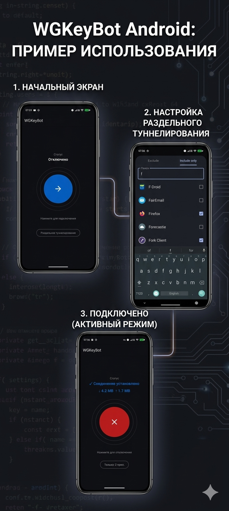

Android-приложение для быстрого подключения к WireGuard-конфигу, полученному через бот `@wg_key_bot`.

## Возможности

- Подключение и отключение VPN в один тап
- Отображение статуса соединения и базовой статистики
- Поддержка раздельного туннелирования по приложениям
- Режимы include/exclude для списка приложений
- Русская локализация интерфейса

## Как использовать

1. Получи ключ через `@wg_key_bot`
2. Импортируй или создай туннель в приложении
3. Нажми кнопку подключения на главном экране
4. При необходимости открой раздельное туннелирование и выбери приложения, которые должны идти через VPN

## Раздельное туннелирование

Приложение позволяет выбрать:
- только приложения, которые должны идти через VPN;
- или приложения, которые нужно исключить из туннеля.

Для удобства доступен поиск по названию приложения и имени пакета.

## Получение конфига

Если ключ ещё не создан, используй Telegram-бота: `@wg_key_bot`.

Проект основан на https://github.com/kiper292/wireguard-turn-android
